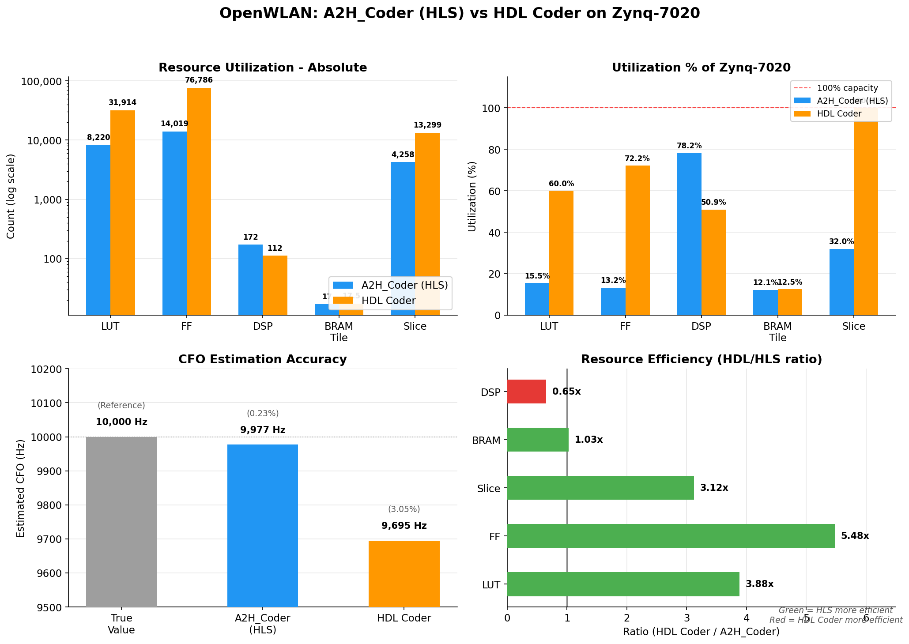
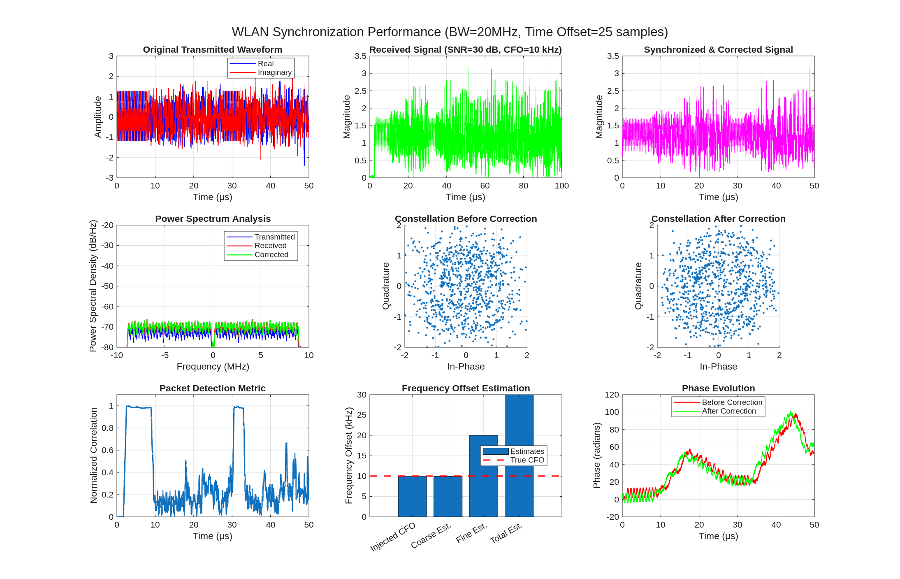

# OpenWLAN: AI-Powered MATLAB-to-HLS Framework for WLAN Synchronization

[](https://www.mathworks.com)
[](LICENSE)
[](https://www.xilinx.com/products/design-tools/vivado/integration/esl-design.html)
[](https://github.com/rockyco/OpenWLAN)

## Overview

OpenWLAN demonstrates automated transformation of WLAN 802.11 time and frequency synchronization algorithms from MATLAB to synthesizable HLS C++. The repository contains two complete implementations targeting the Zynq-7020 FPGA:

- **A2H_Coder** - AI-generated HLS C++ via a 7-phase transformation pipeline (all code AI-generated)
- **HDL Coder** - MathWorks HDL Coder reference implementation (Simulink-based)

Both implementations are functionally equivalent. The AI-generated HLS design uses **3.88x fewer LUTs** and **5.48x fewer flip-flops** at comparable Block RAM, fitting comfortably on the Zynq-7020 where the HDL Coder design saturates it.

## Resource Comparison

Post-implementation utilization on Zynq-7020 (`xc7z020clg400-1`), Vivado 2024.2.2:

| Resource | A2H_Coder (HLS) | HDL Coder | Available | HLS Util% | HDL Util% | Ratio (HDL/HLS) |
|----------|-----------------|-----------|-----------|-----------|-----------|------------------|
| LUT | 8,220 | 31,914 | 53,200 | 15.45% | 59.99% | **3.88x** |
| FF | 14,019 | 76,786 | 106,400 | 13.18% | 72.17% | **5.48x** |
| DSP48E1 | 172 | 112 | 220 | 78.18% | 50.91% | 0.65x |
| Block RAM Tile | 17 | 17.5 | 140 | 12.14% | 12.50% | 1.03x |
| Slice | 4,258 | 13,299 | 13,300 | 32.02% | 99.99% | **3.12x** |

The HLS design trades LUT/FF fabric for DSP48E1 hardened multipliers (172 vs 112) - a deliberate architectural choice that is more power-efficient and frees general-purpose resources. HDL Coder at 99.99% slice utilization has no room for additional logic; the HLS design leaves ~68% of slices available for system integration.

### Block RAM Breakdown

| Component | A2H_Coder (HLS) | HDL Coder | Available |
|-----------|-----------------|-----------|-----------|
| RAMB36E1 | 13 | 16 | 140 |
| RAMB18E1 | 8 | 3 | 280 |
| **Block RAM Tiles** | **17** | **17.5** | **140** |

### Timing

| Metric | A2H_Coder (HLS) | HDL Coder |
|--------|-----------------|-----------|
| Target clock | 100 MHz (10 ns) | 100 MHz (10 ns) |
| Fmax achieved | 117.51 MHz | ~100 MHz |
| WNS | +0.427 ns | Met |
| Timing status | Met | Met |

See [Doc/resource_comparison.md](Doc/resource_comparison.md) for the full analysis including per-module breakdown and primitives summary.



## System Architecture

Five streaming HLS modules connected in series, all achieving II=1 (one sample per clock):

```
                        +---> module3_fine_sync ----+
                        |     (L-LTF correlation)   |
Input --> module0 --> module1 --> module2 -----------> module4 --> Output
          prefilter   packet     coarse_cfo           fine_cfo
          (FIR 51)    detect     (CFO est +            apply
                      (L-STF)    correction)          (fine CFO +
                                                       correction)
```

| Module | Function | DSP | II | Latency |
|--------|----------|-----|----|---------|
| module0_prefilter | 51-tap FIR lowpass filter | 42 | 1 | 0 |
| module1_packet_detect | L-STF autocorrelation packet detection | 20 | 1 | 0 |
| module2_coarse_cfo | Coarse CFO estimation, frequency correction, search buffer extraction | 16 | 1 | 0 |
| module3_fine_sync | L-LTF 160-tap cross-correlation fine timing | 488* | 1 | 167 |
| module4_fine_cfo_apply | Fine CFO estimation and final frequency correction | 16 | 1 | 0 |

*Module 3 csynth DSP estimate (488) is higher than post-implementation (172 system total) due to Vivado scheduling and MUX resolution optimizing the 160-tap correlator.

Target: Zynq-7020 at 100 MHz. Co-simulation latency: 33,640 cycles for 26,155 input samples.

## Performance Validation



Both implementations target the same MATLAB algorithm (SNR=30 dB, true CFO=10 kHz, timing offset=25 samples):

| Metric | True Value | A2H_Coder HLS | HDL Coder |
|--------|-----------|---------------|-----------|
| Total CFO correction | 10,000 Hz | 9,977 Hz (err: 0.23%) | 9,695 Hz (err: 3.05%) |
| Coarse CFO estimate | 10,000 Hz | 9,804 Hz | - |
| Packet detection | - | Exact | Exact |
| Fine timing | - | Exact | Synchronized |
| Waveform avg error | - | 3.31e-03 | - |

A2H_Coder uses floating-point HLS C++, validated via Vitis co-simulation (source: `system_top.log`). HDL Coder uses Simulink-defined fixed-point, with 9,695 Hz reported in [MathWorks documentation](https://au.mathworks.com/help/wireless-hdl/ug/wlanhdltimeandfrequencysynchronization.html). The CFO difference reflects both arithmetic representation (float vs fixed-point) and different noise realizations. A2H_Coder accuracy is also validated at each transformation stage: modular separation (exact), flattening (<1e-10), optimization (<1e-03). See [Doc/resource_comparison.md](Doc/resource_comparison.md#algorithm-accuracy) for the full analysis.

## Project Structure

```
OpenWLAN/
├── Synchronization/
│   ├── A2H_Coder/                          # AI-generated implementation
│   │   ├── wlanSync.m                      # Original algorithm
│   │   ├── wlanSync_modular.m              # Modularized version
│   │   ├── wlanSync_tb.m                   # Algorithm testbench
│   │   ├── wlanSync_modular_tb.m           # Modular testbench
│   │   ├── wlanSync_testdata_generator.m   # Test vector generation
│   │   ├── module0_prefilter/              # Per-module MATLAB + HLS
│   │   ├── module1_packet_detect/          #   Each contains:
│   │   ├── module2_coarse_cfo/             #     *_flat.m, *_opt.m (public)
│   │   ├── module3_fine_sync/              #     *.cpp, *.hpp (private IP)
│   │   ├── module4_fine_cfo_apply/         #     Makefile, testbenches
│   │   ├── system_wlanSync_integrated/     # Top-level HLS integration
│   │   ├── test_vectors/                   # Golden reference data
│   │   ├── architecture_context.md         # System parameters & dependencies
│   │   └── module_registry.json            # Module metadata & metrics
│   └── HDL_Coder/                          # MathWorks reference (read-only)
│       ├── wlanhdlTimeAndFrequencySynchronization.slx
│       └── hdl_prj/                        # Generated Verilog + Vivado project
└── Doc/
    ├── resource_comparison.md              # Quantitative comparison
    ├── resource_comparison.png             # Resource comparison figure
    ├── generate_comparison_figure.py       # Figure generation script
    └── wlan_sync_analysis.png              # Performance visualization
```

The MATLAB source, test vectors, and Makefiles are public. HLS C++ sources (`.cpp`, `.hpp`) are private IP and not included in the repository.

## AI Transformation Pipeline

Each module goes through three MATLAB stages before HLS C++ generation:

**Original** - Uses MATLAB toolbox functions (`wlanPacketDetect`, `filter`, etc.)
**Flattened** - All toolbox calls traced and inlined; explicit loops replace vectorized operations
**Optimized** - Streaming architecture with circular buffers, shift registers, and fixed iteration bounds

Example transformation (module1 packet detection):

```matlab
% Original: toolbox call
[startOffset, Mn] = wlanPacketDetect(filteredWaveform, CBW);

% Flattened: inlined autocorrelation
for pos = 1:(nx - 2*symbolLength + 1)
    correlation_sum = sum(conj(x(pos:pos+15)) .* x(pos+16:pos+31));
    power_sum = sum(abs(x(pos+16:pos+31)).^2);
    Mn(pos) = abs(correlation_sum)^2 / (power_sum^2 + eps);
end

% Optimized: streaming with sliding window (incremental update)
for n = 1:nx
    % Shift register update
    corr_sum = corr_sum + conj(delayed_buf(ptr)) * current_buf(ptr) ...
                        - conj(old_delayed) * old_current;
    power_sum = power_sum + abs(current_buf(ptr))^2 - abs(old_current)^2;
    % Division-free threshold: |corr|^2 > T * power^2
    detected = (abs(corr_sum)^2 > threshold * power_sum^2);
end
```

The 7-phase framework pipeline:
1. **Module separation** - Partition monolithic algorithm into streaming modules
2. **Flattening** - Inline toolbox dependencies, eliminate dynamic features
3. **Optimization** - Streaming architecture, circular buffers, math optimizations
4. **Review** - Algorithmic optimization verification (sliding windows, NCO, division avoidance)
5. **HLS generation** - Translate optimized MATLAB to HLS C++ with pragmas
6. **Fixed-point** - Convert to fixed-point types with bit-width optimization
7. **Integration** - System-level integration, co-simulation, implementation

## Getting Started

### Prerequisites

- **MATLAB R2023b+** with Communications Toolbox and Signal Processing Toolbox
- **Vitis HLS 2024.2** (optional, for HLS synthesis and implementation)

### MATLAB Testing

```bash
cd Synchronization/A2H_Coder
```

```matlab
wlanSync_tb                    % Original algorithm testbench
wlanSync_modular_tb            % Modular implementation testbench
wlanSync_testdata_generator    % Regenerate test vectors
```

Per-module testbenches are in each module directory: `module*_flat_tb.m`, `module*_opt_tb.m`.

### HLS Build (Vitis HLS 2024.2)

From any module directory or `system_wlanSync_integrated/`:

```bash
make csim       # C simulation (functional verification)
make csynth     # C synthesis (generate RTL)
make cosim      # C/RTL co-simulation
make impl       # Vivado implementation (place & route)
make report     # Show synthesis resource/timing report
make clean      # Remove build artifacts
```

For fixed-point mode (Phase 6): append `HLS_CFLAGS=-DPHASE6` to any target.

## References

- [MathWorks WLAN HDL Time and Frequency Synchronization](https://au.mathworks.com/help/wireless-hdl/ug/wlanhdltimeandfrequencysynchronization.html)
- IEEE 802.11 Wireless LAN Standard

## License

This project is licensed under the MIT License - see the [LICENSE](LICENSE) file for details.

## Acknowledgments

- MathWorks for the original WLAN synchronization example
- University of Technology Sydney for research support
